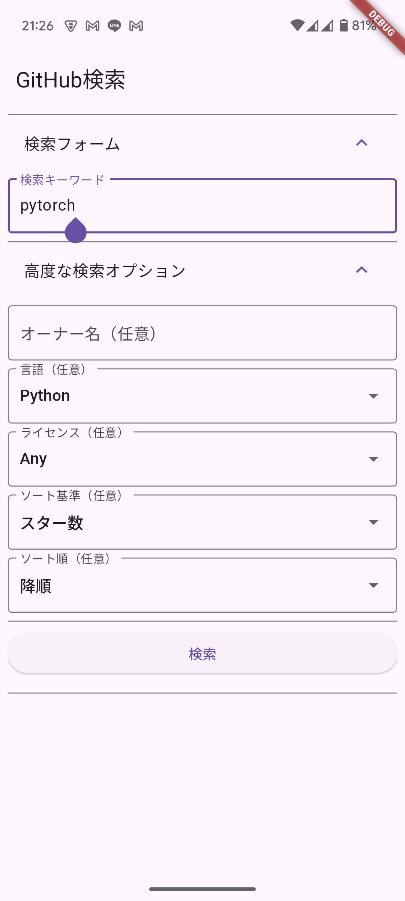
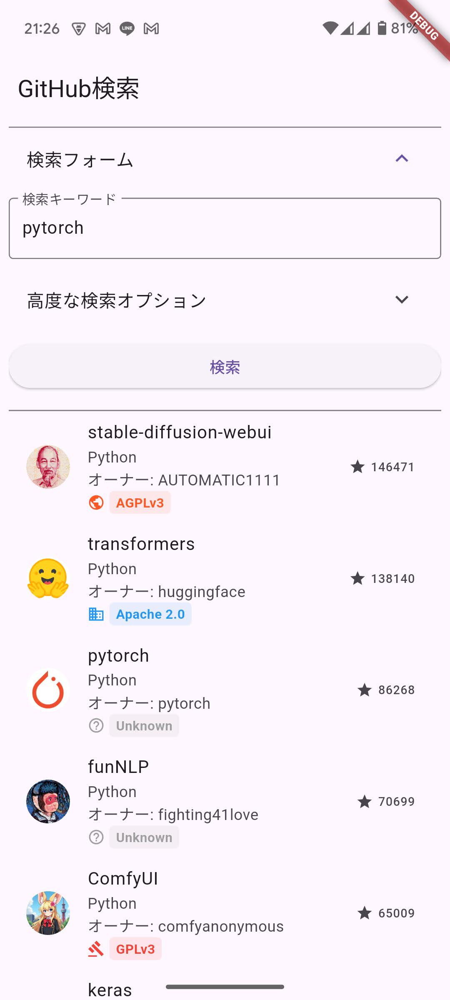
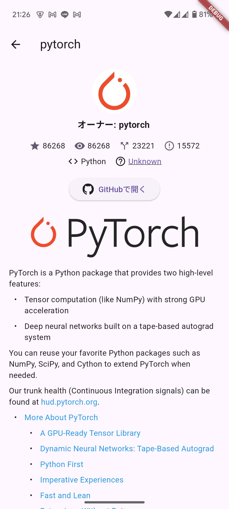
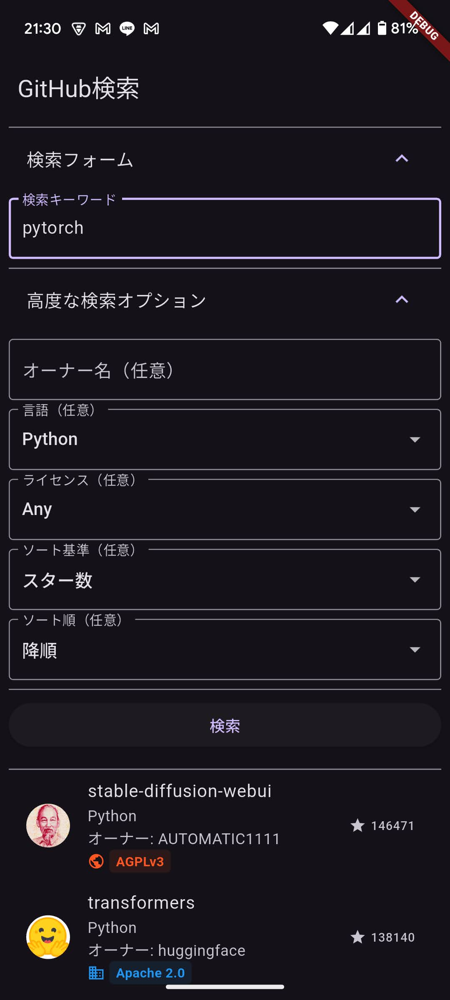

# Github検索

## 概要
**Github検索**は、GitHubリポジトリを検索し、詳細情報（スター数、ウォッチ数、フォーク数、イシュー数、READMEなど）を確認できるFlutterアプリです。  
ユーザーはキーワードやオーナー名、プログラミング言語、ライセンスなどのフィルタを使用して、目的のリポジトリを効果的に検索できます。  
さらに、**ダークモード**と**英語表示**にも対応しており、ユーザーの好みに合わせてインターフェースをカスタマイズできます。

## スクリーンショット
| 検索画面 | 検索結果 | 詳細画面 | ダークモード |
| --- | --- | --- | --- |
|  |  |  |  |


## インストール方法
以下の手順に従って、**Github検索**アプリケーションをローカル環境にセットアップしてください。

### 前提条件
- [Flutter](https://flutter.dev/docs/get-started/install) がインストールされていること
- Gitがインストールされていること

### 手順
1. **リポジトリのクローン**

   ```bash
   git clone https://github.com/your-username/github-search.git
   cd github-search
   ```

2. **依存パッケージのインストール**

   Flutterプロジェクトのルートディレクトリで、以下のコマンドを実行して必要なパッケージをインストールします。

   ```bash
   flutter pub get
   ```

3. **アプリケーションの実行**

   接続されたデバイスまたはエミュレーターでアプリケーションを実行します。

   ```bash
   flutter run
   ```

## 使用方法
1. **アプリ起動**  
   アプリケーションを起動すると、検索画面（SearchScreen）が表示されます。

2. **言語設定**  
   設定メニューからアプリケーションの言語を日本語または英語に切り替えることができます。

3. **テーマ設定**  
   設定メニューからダークモードとライトモードを選択し、インターフェースのテーマを変更できます。

4. **基本的な検索**
    - *検索キーワード入力*  
      検索バーにリポジトリを探すためのキーワードを入力します。
    - *検索ボタン*  
      入力が完了したら、「検索」ボタンをタップしてリポジトリを検索します。

5. **高度な検索**  
   検索フォームの折りたたみメニューから、より詳細な検索オプションを指定できます。
    - *オーナー名*  
      特定のユーザー名を入力して、そのユーザーが所有するリポジトリに絞り込むことができます。
    - *プログラミング言語*  
      指定した言語（Dart、JavaScriptなど）のリポジトリに絞り込みます。
    - *ライセンス*  
      プルダウンからMITやGPLなどのライセンスを選択できます。ここで「Any」を選択するとライセンスフィルタを適用しません。
    - *ソート基準・ソート順*  
      「スター数」や「フォーク数」など、ソート基準を指定できます。ソート順は降順・昇順の選択が可能です。

6. **検索結果の一覧表示**
    - 検索結果がリスト形式で表示されます。
    - 各リポジトリの項目（RepositoryListItem）には、リポジトリ名、オーナー名、言語、ライセンス、スター数などが表示されます。
    - リポジトリ項目をタップすると詳細画面（DetailScreen）に遷移します。

7. **詳細画面でできること**
    - **オーナーアバターと基本情報**  
      上部にオーナーのアバターが表示され、リポジトリ名やオーナー名を確認できます。
    - **スター数・ウォッチ数・フォーク数・イシュー数の確認**  
      アイコン付きで表示されており、タップするとポップアップ（AlertDialog）で説明を確認できます。
    - **プログラミング言語**  
      リポジトリの主な言語が表示されます。
    - **ライセンス**  
      ライセンス情報がアイコンと略称で表示され、タップするとライセンスの公式ページなどの説明ページに移動できます。
        - 初めにアプリ内ブラウザ（In-App WebView）を試み、失敗した場合は外部ブラウザを開きます。
    - **GitHubで開く**  
      「GitHubで開く」ボタンをタップすると、リポジトリのGitHubページをブラウザ（内部ブラウザ→外部ブラウザ）で開きます。
    - **READMEの表示**
        - リポジトリのREADMEをGitHub APIから取得し、Markdown形式で表示します。
        - もしRST形式のREADMEであっても、本文中の画像やリンク、コードブロックなどを一部変換してMarkdownとして表示します。
        - 画像がSVGの場合は、対応してSVGをレンダリングし、他の画像は通常の画像として表示します。
        - README内のリンクをタップすると、やはりアプリ内ブラウザ→外部ブラウザの順に開くようになっています。エラーが起きた場合はスナックバーで通知します。

8. **エラー処理**
    - リポジトリ取得やREADMEの取得時にエラーが発生した場合、画面にエラーメッセージを表示します。
    - リンクを開く際にも失敗時にスナックバーで通知し、外部ブラウザを再試行します。

## 特徴
- **ダークモード対応**  
  ユーザーの好みに合わせてダークモードとライトモードを選択可能です。

- **多言語サポート**  
  日本語と英語に対応しており、ユーザーインターフェースの言語を切り替えることができます。

- **高度な検索機能**  
  キーワード、オーナー名、プログラミング言語、ライセンス、ソート基準など、豊富なフィルタリングオプションを提供します。

- **詳細情報の表示**  
  リポジトリの詳細情報を豊富に表示し、READMEの内容も確認できます。

## ライセンス
本プロジェクトは [GNU Affero General Public License v3.0](https://www.gnu.org/licenses/agpl-3.0) のもとで公開されています。